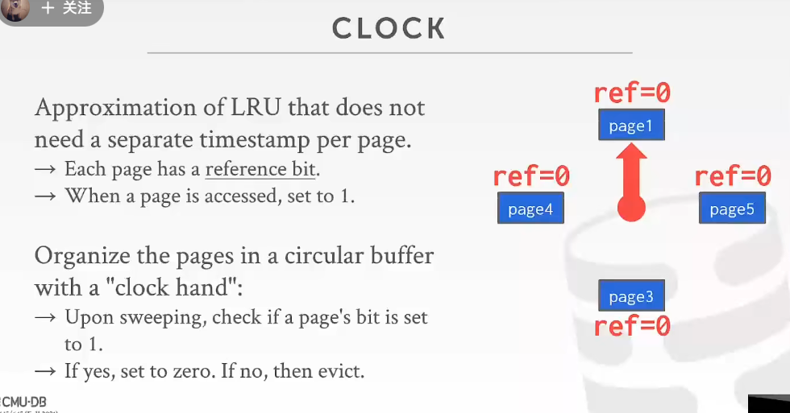

https://www.bilibili.com/video/BV1kG4y1e7Gy?p=5&spm_id_from=pageDriver&vd_source=11445b7fdaa0a53d6d22953bd65957ba

对应project1：https://15445.courses.cs.cmu.edu/fall2021/project1/

空间控制
where to write
一起用的尽量靠近

时间控制
什么时候读，什么时候写
最小化io stall

getpage 步骤
1.加载pagedir
2.将page加载到内存，返回给上层

PageDirectory
指向文件

PageTable
keep track of page in bufferpool
maintain addtional meta data（dirty，refcnt）
追踪引用

Locks
- logic level
- can rollback

latch
- bottom level
- handle concurrency

可选优化
- Multiple Buffer Pools
- Pre-Fetching
- Scan Sharing
- Buffer Pool Bypass

Goals:【平衡】
- 一→Correctness
- 一→Accuracy
- 一→Speed
- 一→Meta-data overhead

## lru
- 访问时间较老的先被移出pool

简化模式,

不适合顺序扫描一系列page
偶尔读一次，

## better：lru-k

相比LRU，LRU-K需要多维护一个队列，用于记录所有缓存数据被访问的历史。只有当数据的访问次数达到K次的时候，才将数据放入缓存。当需要淘汰数据时，LRU-K会淘汰第K次访问时间距当前时间最大的数据。详细实现如下：

## 优先级

根据事务类型确定哪些page重要，哪些不重要

