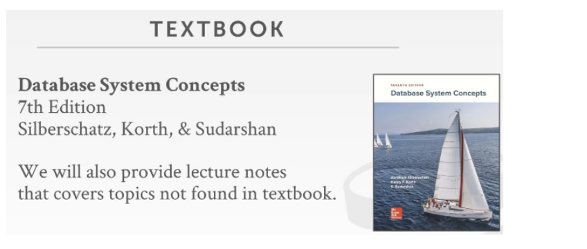

# CMU 15-455

## 课程概览

这门课是的目的是设计并实现一个面向硬盘的数据库管理系统。

大纲：

* 关系型数据库
* 存储
* 执行
* 并行控制
* 恢复
* 分布式数据库
* 杂项

有个有意思的点：提到了云环境

### 时间安排

* 一周两节课，每节都会有相关阅读材料

**学术诚信**

课本：数据库系统概念

​

老师认为做好的数据库系统最好的教科书，他们也会提供一些书里没有设计内容的课程笔记。

### 作业和实验

* 五次家庭作业

  1. 一些SQL查询语句

  除了这个以外，作业都是用纸和笔完成的，这是一种理解我们所讨论的理论只是的方法。

## 项目相关

* 编写： C++ 17
* 关键是存储系统而非数据库系统
* 无法运行SQL语句，也没有查询解析器
* 就像6824一样，各个lab相关联，而非独立，确保第一个正常工作，才能让你的第二，三个项目
